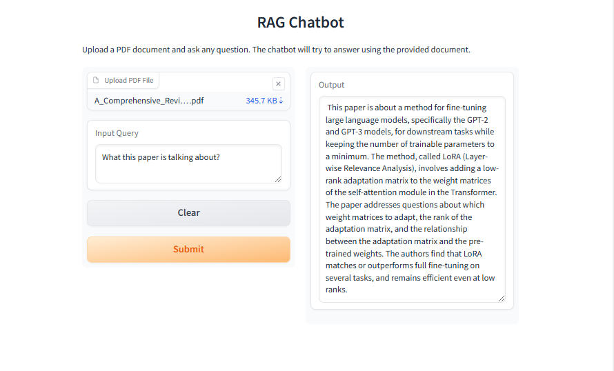

# RAG based QA Bot for Quest Analytics

## Overview
This repository contains a **Retrieval-Augmented Generation (RAG) chatbot** that leverages **IBM Watsonx.ai**, **LangChain**, and **Gradio** to answer questions based on uploaded PDF documents. The chatbot efficiently retrieves relevant document sections and provides precise answers using a **large language model (LLM)**.

## Features
- ✅ **PDF Document Processing**: Loads and processes PDF files to extract text.
- ✅ **Text Splitting**: Splits large documents into manageable chunks for better retrieval.
- ✅ **Vector Embeddings & Storage**: Converts text chunks into embeddings and stores them in a **ChromaDB** vector database.
- ✅ **Retriever-augmented QA**: Uses a retriever to fetch relevant document sections for answering queries.
- ✅ **IBM Watsonx.ai Integration**: Utilizes IBM's Watsonx LLM for intelligent responses.
- ✅ **Interactive UI**: Built using **Gradio** for an easy-to-use web interface.

## Tech Stack
- **Python 3.11**
- **IBM Watsonx.ai** (LLM & Embeddings)
- **LangChain** (Document processing & retrieval)
- **ChromaDB** (Vector storage)
- **Gradio** (Web interface)
- **PyPDF** (PDF parsing)

## Installation & Setup
### 1️⃣ Create a Virtual Environment
```bash
pip install virtualenv
virtualenv my_env
source my_env/bin/activate
```

### 2️⃣ Install Required Packages
```bash
python3.11 -m pip install \
    gradio==4.44.0 \
    ibm-watsonx-ai==1.1.2  \
    langchain==0.2.11 \
    langchain-community==0.2.10 \
    langchain-ibm==0.1.11 \
    chromadb==0.4.24 \
    pypdf==4.3.1 \
    pydantic==2.9.1
```

## Usage
### 🚀 Run the Application
```bash
python qabot.py
```

### 📜 How It Works
1. **Upload a PDF file** to the chatbot interface.
2. **Ask a question** related to the document.
3. The bot **retrieves relevant information** from the PDF using **vector embeddings**.
4. The **IBM Watsonx LLM** generates a detailed and accurate response.
5. The **answer is displayed** in the UI.



## Components
### 1. Document Loader
- Uses `PyPDFLoader` from `langchain_community.document_loaders` to extract text from PDF files.

### 2. Text Splitter
- Implements `RecursiveCharacterTextSplitter` to split documents into manageable chunks.

### 3. Embedding Model
- Utilizes `WatsonxEmbeddings` from `langchain_ibm` for embedding generation.

### 4. Vector Database
- Uses `Chroma` from `langchain_community.vectorstores` to store document embeddings.

### 5. Retriever
- Uses `vector_db.as_retriever()` to fetch relevant document chunks based on user queries.
- **LangChain Retriever Used:** `Chroma.as_retriever()`

### 6. LLM Integration
- Uses `WatsonxLLM` to generate answers based on retrieved document chunks.

### 7. Gradio Interface
- Provides a user-friendly UI for uploading PDFs and querying the chatbot.


## Code Breakdown
### **1. Load Documents**
```python
from langchain_community.document_loaders import PyPDFLoader

def document_loader(file):
    loader = PyPDFLoader(file.name)
    return loader.load()
```
### **2. Split Text into Chunks**
```python
from langchain.text_splitter import RecursiveCharacterTextSplitter

def text_splitter(data):
    text_splitter = RecursiveCharacterTextSplitter(chunk_size=1000, chunk_overlap=50)
    return text_splitter.split_documents(data)
```
### **3. Create Embeddings & Vector Storage**
```python
from langchain_community.vectorstores import Chroma
from langchain_ibm import WatsonxEmbeddings

def watsonx_embedding():
    return WatsonxEmbeddings(model_id="ibm/slate-125m-english-rtrvr", url="https://us-south.ml.cloud.ibm.com")

def vector_database(chunks):
    embedding_model = watsonx_embedding()
    return Chroma.from_documents(chunks, embedding_model)
```
### **4. Build the QA Chain**
```python
from langchain.chains import RetrievalQA
from langchain_ibm import WatsonxLLM

def retriever_qa(file, query):
    llm = WatsonxLLM(model_id='mistralai/mixtral-8x7b-instruct-v01', url="https://us-south.ml.cloud.ibm.com")
    retriever_obj = retriever(file)
    qa = RetrievalQA.from_chain_type(llm=llm, chain_type="stuff", retriever=retriever_obj)
    response = qa.invoke(query)
    return response['result']
```
### **5. Create Gradio Interface**
```python
import gradio as gr
rag_application = gr.Interface(
    fn=retriever_qa,
    inputs=[gr.File(label="Upload PDF"), gr.Textbox(label="Your Question")],
    outputs=gr.Textbox(label="Answer"),
    title="RAG Chatbot",
    description="Upload a PDF and ask questions."
)
rag_application.launch()
```

## 🏆 Applications
- 📄 **Legal Document Search**
- 📚 **Academic Research Assistant**
- 🏢 **Enterprise Knowledge Base**
- 🤖 **AI-Powered Customer Support**
